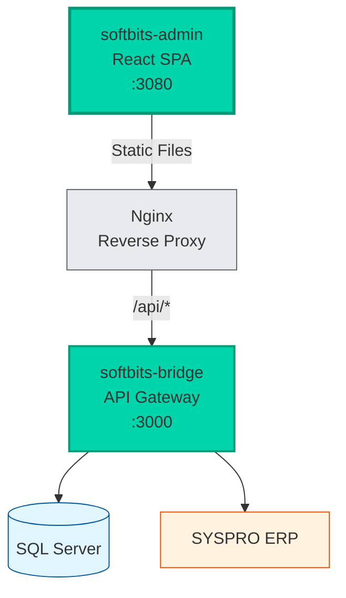
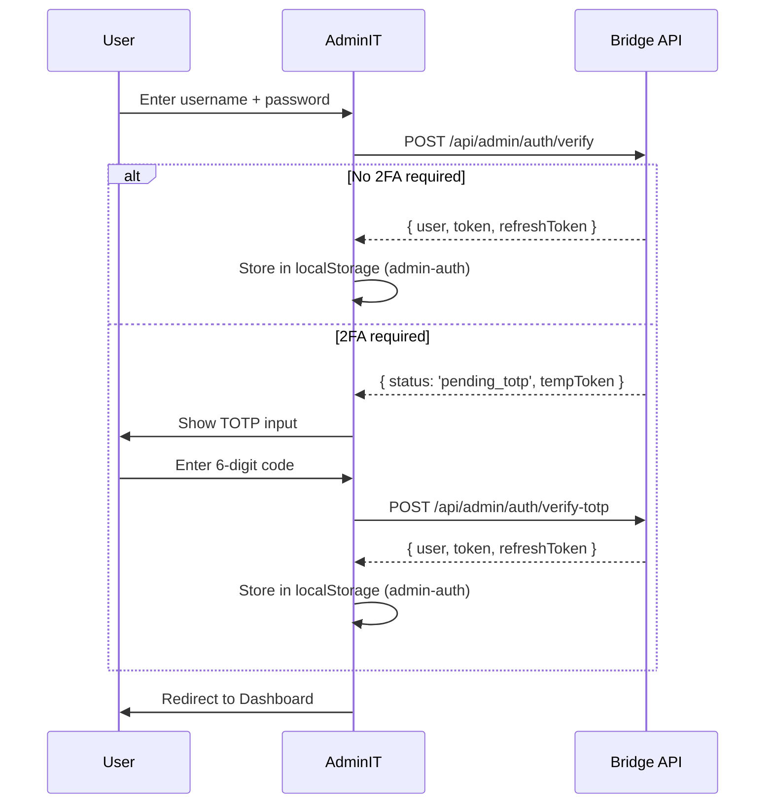

# softBITS AdminIT - Architecture

## Overview

AdminIT is the system administration console for the softBITS platform. It is a React SPA that replaced the former vanilla HTML/JS admin console (31,000 lines across `admin.html` + 30 JS modules in Bridge).

AdminIT manages all 17 admin sections: Dashboard, Security (Users/Roles/Tokens/Devices), Services, Cache, Config (Currencies/Exchange Rates/Configuration/Options), Licensing, Patches, Providers, and 9 app-specific admin pages (ConnectIT, StackIT, FlipIT, FloorIT, LabelIT, ShopIT, InfuseIT, WorkIT, PulpIT).

## Architecture



## Technology Stack

| Technology | Version | Purpose |
|------------|---------|---------|
| React | 18.2.0 | UI framework |
| TypeScript | 5.3.3 | Type safety |
| Vite | 7.3.0 | Build tool |
| Zustand | 5.0.12 | Client state (auth, sidebar) |
| TanStack Query | 5.12.2 | Server state management |
| Axios | 1.6.2 | HTTP client with JWT refresh |
| React Router | 6.21.0 | Client-side routing |
| Tailwind CSS | 3.4.0 | Utility-first styling |
| Lucide React | 0.468.0 | Icons |
| React Hot Toast | 2.4.1 | Notifications |

## Project Structure

```
softbits-admin/
├── docker/nginx.conf          # Nginx proxy (port 3080 -> Bridge:3000)
├── public/icon.svg            # Shield+gear admin icon
├── src/
│   ├── app.tsx                # Root router with auth guard
│   ├── main.tsx               # React entry (providers)
│   ├── config.ts              # VITE_BRIDGE_URL
│   ├── index.css              # Dark theme globals
│   ├── types/index.ts         # TypeScript interfaces
│   ├── services/
│   │   ├── api.ts             # Axios + JWT refresh
│   │   └── admin-service.ts   # All admin API calls
│   ├── hooks/
│   │   ├── use-auth.ts        # Zustand auth (2FA/TOTP)
│   │   ├── use-sidebar.ts     # Zustand sidebar collapse
│   │   └── use-websocket.ts   # Dashboard WebSocket
│   ├── components/
│   │   ├── shared/            # Re-exports from softbits-shared
│   │   ├── layout/            # AdminLayout, Sidebar, Header
│   │   └── dashboard/         # StatusCard, AppStatusGrid
│   ├── pages/
│   │   ├── login-page.tsx
│   │   ├── dashboard-page.tsx
│   │   ├── security/          # Users, Roles, Tokens, Devices
│   │   ├── config/            # Currencies, Exchange Rates, Configuration, Options
│   │   ├── cache-page.tsx
│   │   ├── services-page.tsx
│   │   ├── licensing-page.tsx
│   │   ├── patches-page.tsx
│   │   └── apps/              # 9 app admin pages
│   └── utils/
│       ├── constants.ts       # ADMIN_TABS, STORAGE_KEYS
│       └── formatters.ts      # Re-exports from shared
├── Dockerfile                 # Multi-stage (Node 20 -> nginx)
├── docker-compose.yml         # Port 3080, softbits-network
└── vite.config.ts             # Dev server + proxy
```

## Authentication Flow



## Shared Components

AdminIT uses shared React components from `softbits-shared/components/`:

| Component | Features |
|-----------|----------|
| **DataTable** | Resizable columns, column picker, per-column filters, sorting, pagination, row selection, localStorage persistence |
| **Tabs** | Enable/disable per tab, badge counts, icons |
| **Modal** | Overlay, focus trap, Escape to close, sizes |
| **Button** | Variants, sizes, loading state |
| **Card** | Header, body, footer, header actions |
| **StatusBadge** | success, warning, danger, info, neutral |
| **SearchInput** | Debounced search with clear |
| **EmptyState** | Icon, title, description, action |
| **LoadingSpinner** | Inline and full-page variants |

## Key Features

### Collapsible Sidebar
- Expanded: 240px with icon + label
- Collapsed: 64px with icon only + tooltip
- Smooth CSS transitions
- Role-based tab visibility
- App-aware (hides disabled apps)
- Persisted to localStorage

### Page Inventory (17 sections)

| Route | Page | Source JS Module |
|-------|------|-----------------|
| `/` | Dashboard | admin-dashboard.js |
| `/security/users` | User Management | admin-security.js |
| `/security/roles` | Role Management | admin-security.js |
| `/security/tokens` | Token Management | admin-security.js |
| `/security/devices` | Device Management | admin-devices.js |
| `/services` | Service Monitoring | admin-services.js |
| `/cache` | Cache Management | admin-cache.js |
| `/config` (Currencies tab) | Currencies | currencies-page.tsx |
| `/config` (Exchange Rates tab) | Exchange Rates | exchange-rates-page.tsx |
| `/config` (Configuration tab) | System Settings | configuration-page.tsx |
| `/config` (Options tab) | Option Sets | options-page.tsx |
| `/licensing` | License Management | admin-licensing.js |
| `/patches` | System Patches | admin-patches.js |
| `/providers` | Provider Management | admin-providers.js |
| `/apps/connect` | ConnectIT Admin | admin-connectit.js |
| `/apps/stack` | StackIT Admin | admin-stackit.js |
| `/apps/flip` | FlipIT Admin | admin-flipit.js |
| `/apps/floor` | FloorIT Admin | admin-floorit.js |
| `/apps/labels` | LabelIT Admin | admin-labelit.js |
| `/apps/shop` | ShopIT Admin | admin-shopify.js |
| `/apps/infuse` | InfuseIT Admin | admin-infuseit.js |
| `/apps/work` | WorkIT Admin | admin-workit.js |
| `/apps/pulp` | PulpIT Admin | admin-documents.js |

## Docker/Deployment

- **Dev:** `npm run dev` on port 3080, Vite proxies `/api` to Bridge:3000
- **Prod:** Multi-stage Docker (Node 20 builder -> nginx:alpine runtime)
- **Network:** `softbits-network` bridge, proxies to `softbits-bridge:3000`
- **Health:** `GET /health` returns 200 OK from nginx
