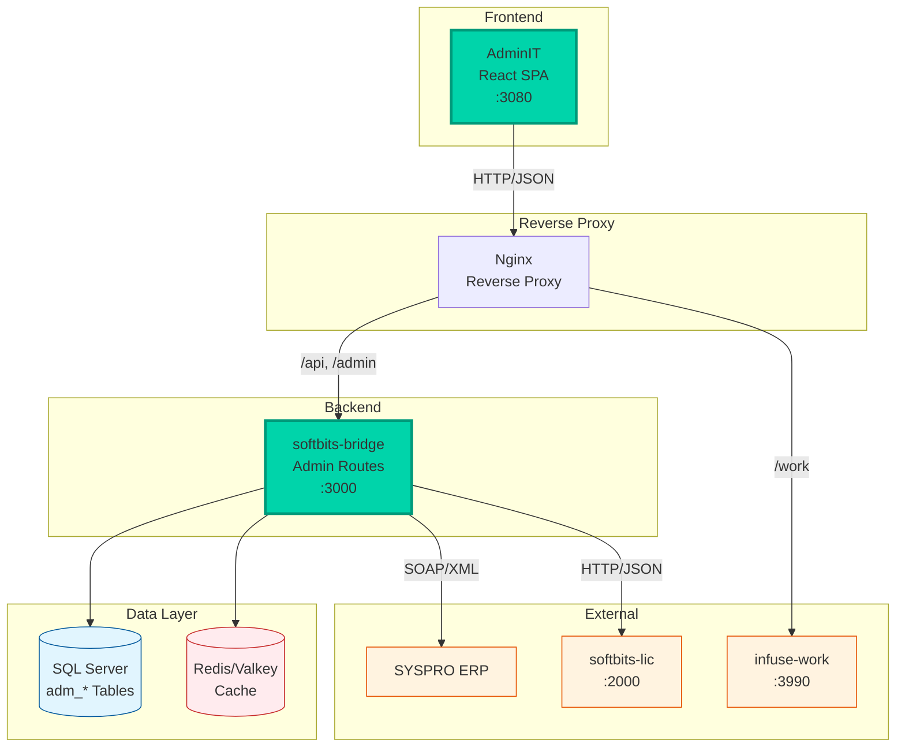

# AdminIT Functional Specification

## Document Information

| Attribute | Value |
|-----------|-------|
| **Product** | AdminIT |
| **Version** | 1.0 |
| **Last Updated** | April 2026 |
| **Status** | Production |

---

## 1. Executive Summary

### 1.1 Purpose
AdminIT is the centralized system administration console for the softBITS platform. It is a React SPA (port 3080) that provides management of users, security, services, caching, licensing, configuration, and per-application settings. It replaced a former 31,000-line vanilla HTML/JS admin console with a modern React + TypeScript architecture.

### 1.2 Scope
This specification covers all functional requirements for AdminIT, including user and role management, service monitoring, cache management, system configuration, ERP configuration, license management, patch management, external provider configuration, and per-application admin pages.

### 1.3 Target Users
- IT administrators
- Security officers
- Operations managers
- Platform engineers

---

## 2. System Overview

### 2.1 Architecture



### 2.2 Technology Stack

| Component | Technology | Version |
|-----------|------------|---------|
| Frontend Framework | React | 18+ |
| Frontend Language | TypeScript | 5+ |
| Build Tool | Vite | 7+ |
| CSS Framework | Tailwind CSS | 3.4+ |
| State Management | Zustand | 5+ |
| Server State | TanStack Query | 5+ |
| HTTP Client | Axios | 1.14+ |
| Icons | Lucide React | 0.577+ |
| Code Editor | CodeMirror | 6+ |
| Component Library | softbits-shared | local |

### 2.3 Backend Architecture

AdminIT has no dedicated backend server. All data operations proxy through Nginx to softbits-bridge:3000. Admin-specific routes are defined in Bridge:

```
softbits-bridge/src/routes/
  admin-settings.js          - System settings CRUD
  admin-devices.js           - Device management
  admin-currencies.js        - Currency configuration
  admin-compliance.js        - License compliance
  admin-email-poller.js      - Email polling configuration
  admin-patches.js           - Patch management
  admin-pos.js               - POS configuration
  admin-providers.js         - External providers
  admin-system.js            - System health and info
  admin-warehouses.js        - Warehouse management
  admin-project-types.js     - Project type management
  admin-project-type-config.js - Project type configuration
```

---

## 3. Functional Requirements

### 3.1 Dashboard

#### FR-DASH-001: System Health Overview
**Description:** Real-time status cards for ERP, database, and cache connections.

**Status Cards:**
| Card | Data Source | Indicators |
|------|------------|------------|
| ERP | `/health` → `syspro` | Type (SYSPRO), Connected/Disconnected |
| Database | `/health` → `database` | Connected/Disconnected |
| Cache | `/health` → `cache` | L1 + Redis / L1 only / Disabled, hit rate |

**Refresh Interval:** 30 seconds

#### FR-DASH-002: App Service Status Table
**Description:** Table showing enabled/disabled state and health for all platform applications.

**Data Source:** `/health` → `apps` object

**Columns:**
| Column | Description |
|--------|-------------|
| App Name | Display name of the application |
| Enabled | Whether the app is enabled |
| Health | Connected/Disconnected status |

#### FR-DASH-003: Quick Stats
**Description:** Summary cards for platform entity counts.

**Cards:**
| Card | Data Source | Icon |
|------|------------|------|
| Users | `/admin/users` | Users |
| Devices | `/admin/devices` | Smartphone |
| Tokens | `/admin/tokens` | Key |
| Cache Entries | `/health` → `cache.keys` | Layers |

#### FR-DASH-004: System Info
**Description:** Platform information panel.

**Fields:**
- Bridge version
- Node.js version
- Platform (OS)
- Uptime (formatted as Xd Xh Xm)
- Total API endpoints

---

### 3.2 Security Management

#### FR-SEC-001: User Management
**Description:** Create, edit, and deactivate console users.

**UI:** Tabbed page (Users / Roles / Tokens)

**User Operations:**
| Operation | Endpoint | Description |
|-----------|----------|-------------|
| List | GET /admin/users | List all users with roles |
| Create | POST /admin/users | Create user with role assignment |
| Update | PUT /admin/users/:id | Update user details |
| Deactivate | PUT /admin/users/:id | Set IsActive = false |

#### FR-SEC-002: Role Management
**Description:** Define roles with granular permissions.

**Role Operations:**
| Operation | Endpoint | Description |
|-----------|----------|-------------|
| List | GET /admin/roles | List all roles |
| Create | POST /admin/roles | Create role with permissions |
| Update | PUT /admin/roles/:id | Update role permissions |
| Delete | DELETE /admin/roles/:id | Delete role |

#### FR-SEC-003: Token Management
**Description:** Issue and revoke API tokens for service accounts and integrations.

**Token Operations:**
| Operation | Endpoint | Description |
|-----------|----------|-------------|
| List | GET /admin/tokens | List all active tokens |
| Create | POST /admin/tokens | Generate new token |
| Revoke | DELETE /admin/tokens/:id | Revoke token |

#### FR-SEC-004: Two-Factor Authentication
**Description:** 2FA/TOTP enrollment and verification for console users.

**Features:**
- QR code generation for TOTP setup
- TOTP verification during login
- Per-user 2FA enforcement

---

### 3.3 Service Management

#### FR-SVC-001: Service Status
**Description:** Real-time health status for all softBITS services.

**UI:** Tabbed page with Services, Endpoints, Providers tabs

**Service List:**
| Service | Display Name |
|---------|-------------|
| softbits-bridge | SoftBITS Bridge |
| softbits-sync | Bridge Sync |
| softbits-poller | Bridge Poller |
| softbits-connect | SoftBITS Connect |
| connect-sync | Connect Sync Engine |
| softbits-flip | SoftBITS Flip |
| softbits-stack | SoftBITS Stack |
| softbits-floor | SoftBITS Floor |

#### FR-SVC-002: Service Logs
**Description:** View and clear per-service log entries.

**Operations:**
| Operation | Endpoint | Description |
|-----------|----------|-------------|
| View | GET /admin/services/:id/logs | Get log entries |
| Clear | DELETE /admin/services/:id/logs | Clear log entries |

#### FR-SVC-003: Dev Tasks
**Description:** Execute maintenance tasks from the admin console.

**Operations:**
| Operation | Endpoint | Description |
|-----------|----------|-------------|
| List | GET /admin/dev-tasks | List available tasks |
| Execute | POST /admin/dev-tasks/:id | Execute a task |

#### FR-SVC-004: Endpoint Registry
**Description:** View all registered API endpoints across the platform.

#### FR-SVC-005: Provider Management
**Description:** Configure external service providers.

---

### 3.4 Cache Management

#### FR-CACHE-001: Cache Statistics
**Description:** View cache hit rates, key counts, and connection status.

**Metrics:**
- L1 (NodeCache) status and statistics
- L2 (Redis/Valkey) connection status
- Hit rate percentage
- Total cached keys

---

### 3.5 Configuration

#### FR-CFG-001: Currency Management
**Description:** Configure multi-currency support.

**UI:** Tabbed page (Currencies / Exchange Rates / Configuration / Options)

#### FR-CFG-002: Exchange Rates
**Description:** Manage currency exchange rates.

#### FR-CFG-003: System Configuration
**Description:** Edit application-level settings stored in `adm_SystemSettings`.

**Setting Categories:** `company.*`, `modules.*`, `cacheWarmer.*`, `connect.sync.*`, `stack.services.*`, `floor.*`, `documents.*`, `email.*`, `pos.*`, `browse.*`

#### FR-CFG-004: Options
**Description:** Manage system option sets and value lists.

---

### 3.6 ERP Configuration

#### FR-ERP-001: SYSPRO Settings
**Description:** Configure ERP connection parameters and company settings.

#### FR-ERP-002: ERP Health
**Description:** Display real-time ERP connectivity status.

---

### 3.7 Licensing

#### FR-LIC-001: Subscription Management
**Description:** View and validate license subscription details.

**UI:** Tabbed page (Subscription / Modules / Compliance / Users / Devices / Warehouses)

**Operations:**
| Operation | Endpoint | Description |
|-----------|----------|-------------|
| View | GET /admin/license | Get license details |
| Validate | POST /admin/license/validate | Validate license |
| Upload | POST /admin/license/upload | Upload new license |

#### FR-LIC-002: Module Management
**Description:** View licensed modules and their enabled/disabled state.

**Data Source:** `GET /admin/license/modules`

#### FR-LIC-003: Compliance Monitoring
**Description:** Monitor license usage against entitlements.

**Data Source:** `GET /admin/license/compliance`

#### FR-LIC-004: User Licensing
**Description:** Per-user license assignment and tracking.

**Operations:**
| Operation | Endpoint | Description |
|-----------|----------|-------------|
| List | GET /admin/license/users | Licensed users list |
| Summary | GET /admin/license/users/summary | Usage summary |

#### FR-LIC-005: Device Management
**Description:** Register, edit, and retire devices with license checks.

**Data Source:** `GET /admin/devices`

#### FR-LIC-006: Warehouse Management
**Description:** Configure licensed warehouse locations.

---

### 3.8 Patch Management

#### FR-PATCH-001: Patch Application
**Description:** Apply system patches to platform components.

#### FR-PATCH-002: Patch History
**Description:** Track applied patches and rollback history.

---

### 3.9 Provider Management

#### FR-PROV-001: External Providers
**Description:** Configure external service providers used by the platform.

---

### 3.10 Application Administration

#### FR-APP-001: Per-Application Admin Pages
**Description:** Dedicated admin pages for each softBITS application module.

**Application Admin Pages:**

| Route | Component | Application |
|-------|-----------|-------------|
| /apps/connect | ConnectAdminPage | ConnectIT CRM |
| /apps/stack | StackAdminPage | StackIT WMS |
| /apps/flip | FlipAdminPage | FlipIT POS |
| /apps/floor | FloorAdminPage | FloorIT Shop Floor |
| /apps/labels | LabelAdminPage | LabelIT Printing |
| /apps/shop | ShopAdminPage | ShopIT E-commerce |
| /apps/infuse | InfuseAdminPage | InfuseIT AI |
| /apps/work | WorkAdminPage | WorkIT Queues |
| /apps/pulp | PulpAdminPage | PulpIT Documents |
| /apps/edit | EditAdminPage | EdIT EDI |
| /apps/email-poller | EmailPollerAdminPage | Email Poller |

**All app admin pages are lazy-loaded for optimal bundle size.**

---

## 4. User Interface Specifications

### 4.1 Navigation Structure

```
AdminIT
 Dashboard                 - System health, app status, quick stats
 Security                  - Users | Roles | Tokens (tabbed)
 Services                  - Services | Endpoints | Providers (tabbed)
 Cache                     - Cache statistics and monitoring
 Configuration             - Currencies | Exchange Rates | Configuration | Options (tabbed)
 ERP Config                - SYSPRO connection and company settings
 Licensing                 - Subscription | Modules | Compliance | Users | Devices | Warehouses (tabbed)
 Patches                   - Patch application and history
 Providers                 - External provider configuration
 Apps
   ConnectIT               - CRM admin settings
   StackIT                 - WMS admin settings
   FlipIT                  - POS admin settings
   FloorIT                 - Shop floor admin settings
   LabelIT                 - Label printing admin settings
   ShopIT                  - E-commerce admin settings
   InfuseIT                - AI integration admin settings
   WorkIT                  - Work queue admin settings
   PulpIT                  - Document management admin settings
   EdIT                    - EDI processing admin settings
   Email Poller            - Email polling admin settings
```

### 4.2 Frontend Routes (React Router)

| Path | Component | Load |
|------|-----------|------|
| / | DashboardPage | Eager |
| /login | LoginPage | Eager |
| /oauth/callback | OAuthCallbackPage | Eager |
| /security | SecurityPage | Lazy |
| /services | ServicesPage | Lazy |
| /cache | CachePage | Lazy |
| /config | ConfigPage | Lazy |
| /erp-config | ErpConfigPage | Lazy |
| /licensing | LicensingPage | Lazy |
| /patches | PatchesPage | Lazy |
| /providers | ProvidersPage | Lazy |
| /apps/connect | ConnectAdminPage | Lazy |
| /apps/stack | StackAdminPage | Lazy |
| /apps/flip | FlipAdminPage | Lazy |
| /apps/floor | FloorAdminPage | Lazy |
| /apps/labels | LabelAdminPage | Lazy |
| /apps/shop | ShopAdminPage | Lazy |
| /apps/infuse | InfuseAdminPage | Lazy |
| /apps/work | WorkAdminPage | Lazy |
| /apps/pulp | PulpAdminPage | Lazy |
| /apps/email-poller | EmailPollerAdminPage | Lazy |
| /apps/edit | EditAdminPage | Lazy |

### 4.3 Layout

**Sidebar:**
- Collapsible: 240px expanded, 64px collapsed
- Icon tooltips when collapsed
- Section grouping: Bridge, Apps

**Content Area:**
- PageHeader component with title and description
- Tabbed sub-navigation where applicable
- Responsive grid layouts for cards and tables

### 4.4 UI Components

AdminIT uses shared components from `softbits-shared`:
- DataTable (sortable, filterable)
- Modal (create/edit dialogs)
- Tabs (section navigation)
- Button, Card, StatusBadge
- LoadingSpinner, PageHeader, PageStatusBar

### 4.5 Responsive Design

| Breakpoint | Width | Layout |
|------------|-------|--------|
| Mobile | < 768px | Single column, collapsed sidebar |
| Tablet | 768-1024px | Collapsible sidebar |
| Desktop | > 1024px | Full sidebar, multi-column grids |

### 4.6 Theme

- Dark theme with teal/mint primary colors (`#00d4aa`)
- Semantic color tokens for text, surfaces, and borders
- Font: Inter, system-ui fallback

---

## 5. Authentication and Authorization

### 5.1 Authentication Flow

```mermaid
sequenceDiagram
    participant User
    participant AdminIT
    participant Bridge
    participant DB

    User->>AdminIT: Navigate to /login
    AdminIT->>User: Show login form
    User->>AdminIT: Enter credentials
    AdminIT->>Bridge: POST /auth/login
    Bridge->>DB: Validate credentials
    DB-->>Bridge: User record
    Bridge-->>AdminIT: JWT + Refresh Token
    AdminIT->>AdminIT: Store in Zustand (persisted)
    AdminIT->>User: Redirect to Dashboard

    Note over AdminIT,Bridge: Subsequent requests
    AdminIT->>Bridge: GET /admin/* (Bearer token)
    Bridge-->>AdminIT: Response data

    Note over AdminIT,Bridge: Token refresh
    AdminIT->>Bridge: POST /auth/refresh
    Bridge-->>AdminIT: New JWT + Refresh Token

    style AdminIT fill:#00d4aa,stroke:#009a7a,stroke-width:2px
    style Bridge fill:#00d4aa,stroke:#009a7a,stroke-width:2px
    style DB fill:#e1f5fe,stroke:#01579b
```

### 5.2 Authorization

- Role-based access control via Bridge roles/permissions
- Tab visibility controlled per role
- Zustand auth store with persist middleware

### 5.3 OAuth Callback

AdminIT handles OAuth callbacks at `/oauth/callback` for external provider integrations. This route renders regardless of authentication state to support popup-based OAuth flows.

---

## 6. Non-Functional Requirements

### 6.1 Performance

| Metric | Target |
|--------|--------|
| Page Load | < 2 seconds |
| Dashboard Refresh | 30-second interval |
| API Response | < 500ms |
| Bundle Size | Lazy-loaded pages |

### 6.2 Security

- JWT authentication with automatic refresh
- 2FA/TOTP enforcement available
- API tokens for service accounts
- No direct database access from frontend

### 6.3 Browser Support

| Browser | Version |
|---------|---------|
| Chrome | 90+ |
| Firefox | 90+ |
| Edge | 90+ |
| Safari | 14+ |

---

## 7. API Endpoint Summary

### Admin Routes (Bridge)

| Method | Endpoint | Description |
|--------|----------|-------------|
| GET | /health | System health status |
| GET | /admin/about | System info (version, uptime) |
| GET | /admin/users | List users |
| POST | /admin/users | Create user |
| PUT | /admin/users/:id | Update user |
| GET | /admin/roles | List roles |
| POST | /admin/roles | Create role |
| PUT | /admin/roles/:id | Update role |
| DELETE | /admin/roles/:id | Delete role |
| GET | /admin/tokens | List tokens |
| POST | /admin/tokens | Create token |
| DELETE | /admin/tokens/:id | Revoke token |
| GET | /admin/devices | List devices |
| POST | /admin/devices | Register device |
| PUT | /admin/devices/:id | Update device |
| GET | /admin/services | List services |
| GET | /admin/services/:id/logs | Service logs |
| DELETE | /admin/services/:id/logs | Clear logs |
| GET | /admin/dev-tasks | List dev tasks |
| POST | /admin/dev-tasks/:id | Execute task |
| GET | /admin/service-versions | Service versions |
| GET | /api/admin/settings | List settings |
| PUT | /api/admin/settings | Update settings |
| GET | /api/admin/currencies | List currencies |
| POST | /api/admin/currencies | Create currency |
| PUT | /api/admin/currencies/:id | Update currency |
| GET | /admin/license | License details |
| POST | /admin/license/validate | Validate license |
| POST | /admin/license/upload | Upload license |
| GET | /admin/license/usage | License usage |
| GET | /admin/license/modules | Licensed modules |
| GET | /admin/license/users | Licensed users |
| GET | /admin/license/users/summary | User summary |
| GET | /admin/license/compliance | Compliance data |
| GET | /api/admin/patches | List patches |
| POST | /api/admin/patches | Apply patch |
| GET | /api/admin/providers | List providers |
| PUT | /api/admin/providers/:id | Update provider |
| GET | /api/admin/warehouses | List warehouses |
| POST | /api/admin/warehouses | Create warehouse |
| PUT | /api/admin/warehouses/:id | Update warehouse |

---

*Document Version: 1.0*
*Last Updated: April 2026*
